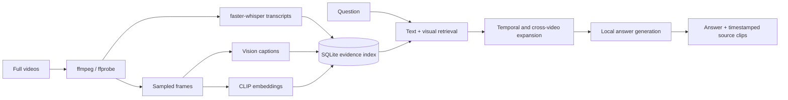

# LongVideo RAG

A local-first multimodal retrieval and question-answering system for long-form video.

LongVideo RAG turns full videos into a persistent evidence index containing timestamped transcripts, sampled frames, visual captions, and CLIP embeddings. Queries are answered from retrieved evidence and returned with playable source clips rather than as uncited model output.

> **Project status:** working research/engineering prototype. The core indexing, retrieval, QA, CLI, and web paths are implemented and covered by local tests. It is not a complete reproduction of the VideoRAG paper: in particular, it does not implement the paper's full LLM-built knowledge graph or upstream reranking pipeline.

## Why this project exists

Long videos create a retrieval problem that plain transcript RAG handles badly: some questions are answered by spoken text, some by diagrams or frames, and useful evidence often spans neighboring segments or multiple videos. This project explores a simple local architecture for combining those channels while preserving enough provenance to show a user where an answer came from.

The design priorities are:

- **evidence first** - every retrieved item carries source-video and timestamp provenance;
- **multiple retrieval channels** - transcript/lexical evidence and visual similarity can contribute independently;
- **temporal context** - strong hits can expand to neighboring segments rather than being treated as isolated chunks;
- **cross-video retrieval** - a collection can be searched as one evidence space;
- **local execution** - transcription, embeddings, vision captioning, and answer generation can all run without a hosted model API;
- **inspectability** - retrieval reasons are kept separately from generated answers.

## Reviewer guide

If you are reading this repository as a coding sample, the most representative files are:

| File | What to inspect |
| --- | --- |
| [`src/longvideo_rag/retrieval.py`](src/longvideo_rag/retrieval.py) | multi-channel ranking, temporal/cross-video expansion, and retrieval provenance |
| [`src/longvideo_rag/store.py`](src/longvideo_rag/store.py) | persistent evidence/index model and query surface |
| [`src/longvideo_rag/extraction.py`](src/longvideo_rag/extraction.py) | segmentation and media-processing pipeline |
| [`src/longvideo_rag/providers.py`](src/longvideo_rag/providers.py) | model/provider boundaries for local transcription, vision, and embeddings |
| [`src/longvideo_rag/qa.py`](src/longvideo_rag/qa.py) | evidence-grounded answer construction |
| [`tests/test_retrieval.py`](tests/test_retrieval.py) | retrieval behavior and ranking invariants |
| [`tests/test_extraction.py`](tests/test_extraction.py) | local media fixtures and extraction behavior |
| [`tests/test_qa.py`](tests/test_qa.py) | answer/evidence behavior |
| [`tests/test_web.py`](tests/test_web.py) | application routes and serving path |

## Architecture



The persisted unit is a timestamped video segment. A segment can carry transcript text, visual description, frame paths, visual embeddings, collection/video metadata, and extraction provenance. The retrieval layer combines independent evidence channels rather than collapsing them at ingestion time.

## Current demo

The repository has been exercised on three full videos from 3Blue1Brown's *Essence of Linear Algebra* (chapters 1-3), producing 43 timestamped segments with transcript and visual evidence. That dataset is an example workload rather than a requirement of the system.

## Quick start

### Prerequisites

- Python 3.11+
- `ffmpeg` and `ffprobe` on `PATH`
- Ollama for the local generation/vision demo paths

```bash
python -m venv .venv
# Windows: .venv\Scripts\activate
# Unix/macOS: source .venv/bin/activate
python -m pip install --upgrade pip
python -m pip install -e ".[vision]"
```

For the example-video download workflow, also install the demo extra:

```bash
python -m pip install -e ".[vision,demo]"
```

Example local models used during development:

```bash
ollama pull qwen2.5:3b
ollama pull granite3.2-vision:2b
```

### Index videos

```bash
longvideo-rag --db .longvideo/index.sqlite3 index-videos \
  videos/lesson-01.mp4 videos/lesson-02.mp4 \
  --collection-title "Example Course" \
  --video-facet "course=Example Course" \
  --segment-seconds 45 \
  --language en \
  --whisper-model base.en \
  --frames-per-segment 2 \
  --visual-embedding-model openai/clip-vit-base-patch32 \
  --artifacts-dir .longvideo/artifacts \
  --output .longvideo/manifest.json
```

### Optionally enrich segments with visual captions

```bash
longvideo-rag --db .longvideo/index.sqlite3 enrich-visual \
  .longvideo/manifest.json \
  --frames-per-segment 2 \
  --vision-model granite3.2-vision:2b \
  --artifacts-dir .longvideo/artifacts \
  --output .longvideo/manifest.json \
  --checkpoint \
  --skip-existing-captions \
  --ingest
```

Checkpointing makes long captioning runs resumable. Existing captions are only reused when they were produced by the same configured vision model, avoiding silent mixing of providers.

### Search or ask

```bash
longvideo-rag --db .longvideo/index.sqlite3 search \
  "Which visual demonstrates a linear transformation?" \
  --visual-embedding-model openai/clip-vit-base-patch32 \
  --top-k 8

longvideo-rag --db .longvideo/index.sqlite3 ask \
  "How does the interpretation of vectors develop into linear transformations?" \
  --model qwen2.5:3b \
  --visual-embedding-model openai/clip-vit-base-patch32 \
  --top-k 8 \
  --show-evidence
```

### Serve the web app

```bash
longvideo-rag --db .longvideo/index.sqlite3 serve \
  --host 127.0.0.1 \
  --port 8787 \
  --model qwen2.5:3b \
  --visual-embedding-model openai/clip-vit-base-patch32
```

The web path returns the generated answer together with playable source clips, timestamps, transcript excerpts, and available visual captions.

## Repository structure

```text
src/longvideo_rag/
  cli.py          command-line entry points
  extraction.py   transcription / frame extraction pipeline
  ingest.py       manifest ingestion
  media.py        ffmpeg/ffprobe helpers
  models.py       data models
  providers.py    local model/provider adapters
  qa.py           evidence-grounded answer path
  retrieval.py    retrieval and expansion logic
  store.py        SQLite-backed evidence store
  web.py          local web application
  web_static/     browser UI assets

tests/
  test_extraction.py
  test_qa.py
  test_retrieval.py
  test_web.py
```

## Testing

The tests are deliberately local and do not require a hosted model API.

```bash
python -m unittest discover -s tests -v
python -m pip check
```

The suite exercises short generated MP4 fixtures, extraction, retrieval, grounded-answer behavior, caption enrichment/resume handling, and web routes.

## Design limitations

- Retrieval quality is not benchmarked against a large labelled video-QA corpus, so the current ranking choices should be treated as engineering heuristics rather than calibrated optimal weights.
- CLIP frame embeddings and precomputed vision captions are useful but lossy representations of visual content.
- The system currently uses segment-level retrieval rather than a learned hierarchical index.
- Local model quality and latency depend heavily on the selected Ollama/Whisper/vision models and hardware.
- The project is inspired by the multimodal retrieval problem addressed by VideoRAG but intentionally implements a smaller, inspectable architecture rather than claiming paper-level feature parity.

## Possible next steps

The most useful extensions would be an explicit retrieval benchmark, learned reranking over the existing evidence channels, query-aware temporal expansion, and evaluation of retrieval/answer quality as the collection scales to much longer multi-video corpora.
