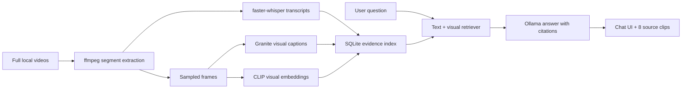

# LongVideo RAG

Local multimodal question answering across full videos. This Python app transcribes video
segments locally, samples frames, retrieves by transcript and CLIP visual similarity, stores
precomputed vision captions, and answers questions through Ollama with timestamped source clips
shown beside the chat.

The current demo indexes three full videos from 3Blue1Brown's *Essence of Linear Algebra*:
Chapters 1-3 (`43` timestamped segments). The web interface always generates a local answer and
shows `8` supporting clips.

## What It Does

- Transcribes local video files with `faster-whisper`.
- Extracts audio and sampled frames with `ffmpeg`/`ffprobe`.
- Generates segment-level visual captions with a local Ollama vision model.
- Embeds sampled frames with CLIP for text-to-visual retrieval.
- Retrieves transcript and visual evidence across multiple videos with temporal and cross-video
  expansion.
- Generates cited answers with a local Ollama language model.
- Serves a dark, compact chat UI with playable timestamped source clips.

This is an improved practical multi-video implementation of the multimodal retrieval channel
described by VideoRAG. It does not implement the paper's complete LLM-built knowledge graph or
full upstream retrieval/reranking pipeline.

## Pipeline



## Quickstart

These steps build the current three-full-video multimodal app from scratch on Windows
PowerShell.

### 1. Prerequisites

Install:

- Python `3.11+`
- [FFmpeg](https://ffmpeg.org/) with `ffmpeg` and `ffprobe` on `PATH`
- [Ollama](https://ollama.com/) running locally

Verify:

```powershell
py -3.11 --version
ffmpeg -version
ffprobe -version
ollama --version
```

### 2. Create The Environment

```powershell
cd C:\videoRAG
py -3.11 -m venv .venv
.\.venv\Scripts\python.exe -m pip install --upgrade pip
.\.venv\Scripts\python.exe -m pip install -r .\requirements.txt
.\.venv\Scripts\python.exe -m pip install -e .
```

The requirements include Pillow, Torch, and Transformers for frame handling and CLIP
retrieval, plus `yt-dlp` for the example downloads. Whisper and CLIP models are downloaded on
first use unless local model paths are provided.

### 3. Pull Local Models

```powershell
ollama pull qwen2.5:3b
ollama pull granite3.2-vision:2b
```

- `qwen2.5:3b` generates grounded chat answers.
- `granite3.2-vision:2b` precomputes higher-quality captions for educational diagrams.

Granite caption generation is slow on CPU-only machines. The caption step below checkpoints
after each segment and can be resumed safely.

### 4. Download Three Full Videos

```powershell
New-Item -ItemType Directory -Force .\.longvideo\three_video_videos | Out-Null

.\.venv\Scripts\yt-dlp.exe --merge-output-format mp4 --remux-video mp4 `
  -o ".\.longvideo\three_video_videos\chapter-01.%(ext)s" `
  "https://www.youtube.com/watch?v=fNk_zzaMoSs"
.\.venv\Scripts\yt-dlp.exe --merge-output-format mp4 --remux-video mp4 `
  -o ".\.longvideo\three_video_videos\chapter-02.%(ext)s" `
  "https://www.youtube.com/watch?v=k7RM-ot2NWY"
.\.venv\Scripts\yt-dlp.exe --merge-output-format mp4 --remux-video mp4 `
  -o ".\.longvideo\three_video_videos\chapter-03.%(ext)s" `
  "https://www.youtube.com/watch?v=kYB8IZa5AuE"
```


### 5. Transcribe And Build Visual Embeddings

This creates timestamped segments, local transcripts, sampled frames, and CLIP embeddings. It
does not wait for expensive vision captions.

```powershell
$videos = @(
  ".\.longvideo\three_video_videos\chapter-01.mp4"
  ".\.longvideo\three_video_videos\chapter-02.mp4"
  ".\.longvideo\three_video_videos\chapter-03.mp4"
)

.\.venv\Scripts\longvideo-rag.exe --db .\.longvideo\three_video_index.sqlite3 index-videos @videos `
  --collection-id 3b1b-linear-algebra-chapters-1-3 `
  --collection-title "Essence of Linear Algebra - Chapters 1-3" `
  --collection-facet "publisher=3Blue1Brown" `
  --video-facet "course=Essence of Linear Algebra" `
  --segment-seconds 45 `
  --language en `
  --whisper-model base.en `
  --whisper-device cpu `
  --whisper-compute-type int8 `
  --frames-per-segment 2 `
  --visual-embedding-model openai/clip-vit-base-patch32 `
  --vision-device cpu `
  --artifacts-dir .\.longvideo\three_video_artifacts `
  --output .\.longvideo\three_video_multimodal_manifest.json
```

You can launch the app after this step: transcripts and visual similarity are already indexed.

### 6. Precompute Granite Vision Captions

Enrich the existing manifest without retranscribing or rebuilding CLIP embeddings:

```powershell
.\.venv\Scripts\longvideo-rag.exe --db .\.longvideo\three_video_index.sqlite3 enrich-visual `
  .\.longvideo\three_video_multimodal_manifest.json `
  --segment-seconds 45 `
  --frames-per-segment 2 `
  --vision-model granite3.2-vision:2b `
  --artifacts-dir .\.longvideo\three_video_artifacts `
  --output .\.longvideo\three_video_multimodal_manifest.json `
  --checkpoint `
  --skip-existing-captions `
  --ingest
```

`--checkpoint` saves after every segment. `--skip-existing-captions` resumes only captions
already produced successfully by the same vision model, so changing the model regenerates
captions instead of silently mixing providers.

On the current local run, this produced Granite captions for all `43/43` segments. Confirm the
indexed segment totals and the manifest caption count:

```powershell
.\.venv\Scripts\longvideo-rag.exe --db .\.longvideo\three_video_index.sqlite3 stats

@'
import json
from pathlib import Path

data = json.loads(Path(r".longvideo\three_video_multimodal_manifest.json").read_text())
segments = [segment for video in data["videos"] for segment in video["segments"]]
captioned = sum(bool(segment.get("visual_caption", "").strip()) for segment in segments)
print(f"{captioned}/{len(segments)} captions")
'@ | .\.venv\Scripts\python.exe -
```

### 7. Start The Chat App

Use precomputed captions and CLIP retrieval at query time. Do not add `--vision-model` here
unless you deliberately want slow, question-specific recaptioning of retrieved clips.

```powershell
.\.venv\Scripts\longvideo-rag.exe --db .\.longvideo\three_video_index.sqlite3 serve `
  --host 127.0.0.1 `
  --port 8787 `
  --model qwen2.5:3b `
  --facet "course=Essence of Linear Algebra" `
  --visual-embedding-model openai/clip-vit-base-patch32 `
  --vision-device cpu
```

Open [http://127.0.0.1:8787](http://127.0.0.1:8787).

The current interface displays:

- Local chat answers generated by `qwen2.5:3b`.
- Exactly `8` retrieved source clips for each answer.
- Playable video evidence with timestamps, transcript excerpts, and visual captions.
- Status for the active index, currently `3 videos | 43 clips | 43 visual`.

## CLI Usage

### Search Evidence

```powershell
.\.venv\Scripts\longvideo-rag.exe --db .\.longvideo\three_video_index.sqlite3 search `
  "Which visual demonstrates a linear transformation?" `
  --facet "course=Essence of Linear Algebra" `
  --visual-embedding-model openai/clip-vit-base-patch32 `
  --top-k 8
```

### Ask Locally With Evidence

```powershell
.\.venv\Scripts\longvideo-rag.exe --db .\.longvideo\three_video_index.sqlite3 ask `
  "How does the interpretation of vectors develop into linear transformations?" `
  --model qwen2.5:3b `
  --facet "course=Essence of Linear Algebra" `
  --visual-embedding-model openai/clip-vit-base-patch32 `
  --top-k 8 `
  --show-evidence
```

### Index Your Own Videos

```powershell
.\.venv\Scripts\longvideo-rag.exe --db .\.longvideo\my_videos.sqlite3 index-videos `
  .\videos\lesson-01.mp4 .\videos\lesson-02.mp4 `
  --collection-title "My Course" `
  --video-facet "course=My Course" `
  --segment-seconds 45 `
  --language en `
  --whisper-model base.en `
  --frames-per-segment 2 `
  --visual-embedding-model openai/clip-vit-base-patch32 `
  --artifacts-dir .\.longvideo\my_video_artifacts `
  --output .\.longvideo\my_video_manifest.json
```

Then use `enrich-visual` and `serve` as shown in the quickstart, substituting your database,
manifest, artifacts directory, and facet.

## Data Model

The persisted JSON manifest contains collections, complete source videos, and timestamped
segments:

```json
{
  "collection": {"id": "course", "title": "Course"},
  "videos": [
    {
      "external_id": "lesson-01",
      "title": "Lesson 1",
      "source_uri": "videos/lesson-01.mp4",
      "metadata": {"course": "Course"},
      "segments": [
        {
          "ordinal": 0,
          "start_ms": 0,
          "end_ms": 45000,
          "transcript": "Spoken evidence here.",
          "visual_caption": "A coordinate grid shows two vectors and a transformation matrix.",
          "frame_paths": [".longvideo/artifacts/lesson-01/000000/frame-001.jpg"],
          "visual_embedding": [0.12, -0.04, 0.18],
          "metadata": {"extraction": {"visual_captioner": "ollama-vision:granite3.2-vision:2b"}}
        }
      ]
    }
  ]
}
```

Manifests can also be ingested directly:

```powershell
.\.venv\Scripts\longvideo-rag.exe --db .\.longvideo\demo.sqlite3 ingest .\examples\course_manifest.json
```

## Testing

```powershell
$env:PYTHONPATH = "src"
.\.venv\Scripts\python.exe -m unittest discover -s tests -v
.\.venv\Scripts\python.exe -m pip check
```

The tests create short local MP4 fixtures with `ffmpeg`, validate audio/frame extraction,
multimodal retrieval, grounded answer behavior, caption enrichment/resume handling, and the web
application routes.
